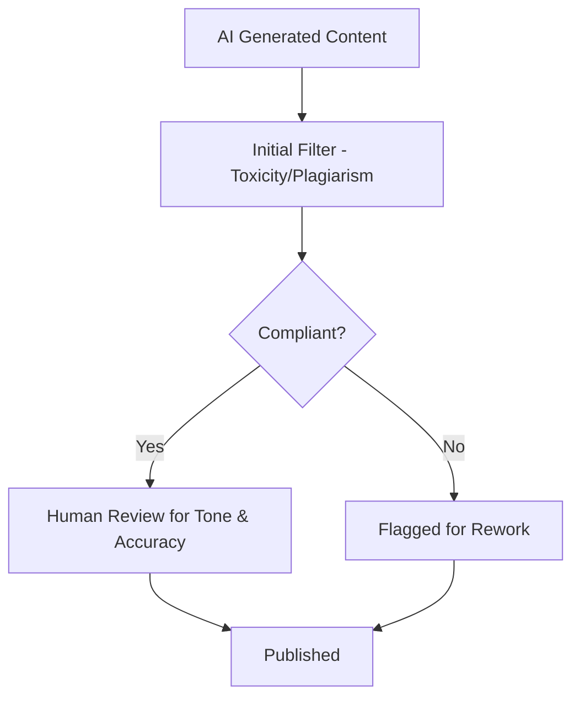

# Content Moderation Flow – AI & Human-in-the-Loop

```mermaid
flowchart TD
  A[AI Generated Content] --> B[Initial Filter - Toxicity/Plagiarism]
  B --> C{Compliant?}
  C -- Yes --> D[Human Review for Tone & Accuracy]
  C -- No --> E[Flagged for Rework]
  D --> F[Published]
  E --> F
```

## Tools:
- AI Moderation APIs (OpenAI, Perspective)
- In-house editorial platforms
